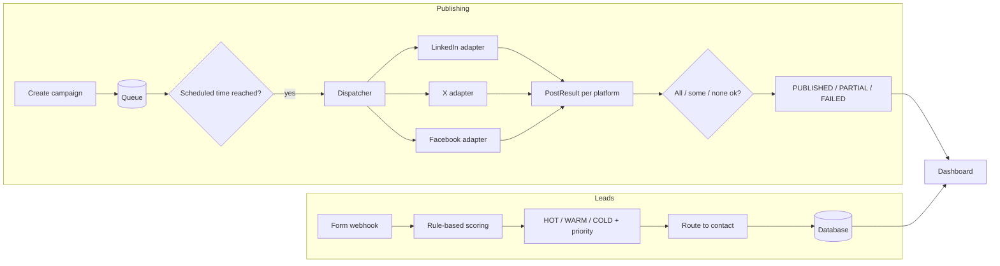

# Trinops Marketing Scheduler

Write a post once, schedule it, and publish it to LinkedIn, X and Facebook from one queue -
plus a webhook that captures inbound leads and scores them automatically.

## The problem

Posting consistently across platforms is repetitive and easy to forget: log into three
sites, reformat the same message three times, and remember to do it on the right day. And the
leads that marketing brings in usually land in an inbox where the good ones get the same
attention as the time-wasters.

This service fixes both. Content is scheduled once and fanned out to every platform by a
background dispatcher. Inbound enquiries hit a webhook, get scored by rules, and are routed to
the right person before anyone reads them.

## How it works



**No AI in the core.** Publishing is plain API calls behind a shared adapter interface; lead
scoring is arithmetic on structured form fields. There are no Claude or other LLM calls in
this project at all - see [Where Claude could be added](#where-claude-could-be-added) for the
optional extensions.

### Publishing

- One campaign targets one or more platforms. The dispatcher checks the queue every few
  minutes and publishes anything whose scheduled time has passed.
- Each platform sits behind a `PlatformAdapter` (see `marketing/adapters/`). Adding a platform
  is one new adapter file plus its name in `ENABLED_PLATFORMS` - the scheduler and publisher
  never change.
- Every platform gets its own `PostResult` row. One platform failing never blocks the others:
  the campaign lands in `PARTIAL` and the failed platform can be retried on its own.

### Lead capture

- A single webhook (`POST /leads/webhook`) accepts any form payload - extra fields are stored
  verbatim, so any form provider works without a schema change.
- Scoring uses three structured signals - budget, company size and service interest - to
  produce a 0-85 score, a HOT/WARM/COLD category and a 1-3 priority.
- The service interest decides routing: known services go to their owner (configurable in
  `LEAD_ROUTING`), everything else to the default contact.

### Dashboard

Two-page admin view (vanilla JS, no framework):

- **Campaigns** - a queue with per-platform status pills (and retry counts), a "New campaign"
  form, publish-now and per-platform retry actions, and a month calendar of scheduled posts.
- **Leads** - an inbox sorted by priority with category badges and routing, editable per-lead
  notes, and an expandable "How is the lead score worked out?" panel rendered from the live
  scoring rules (so it can never drift from the code).

## Quick start (demo mode)

No social accounts, no API keys, no setup beyond Docker:

```bash
docker compose up --build
```

Then open <http://localhost:8000>. Demo mode:

- seeds five campaigns - three already due (published at startup) and two scheduled for the
  future (still queued)
- publishes to a local `data/published/<platform>/` folder instead of real platform APIs, so
  every post is inspectable as JSON
- simulates a transient outage on one platform (`DEMO_FLAKY_PLATFORM`, default `facebook`):
  its first publish attempt fails - so a campaign lands in `PARTIAL` - but clicking retry
  succeeds, showing the full fail → retry → `PUBLISHED` recovery
- seeds six leads spanning HOT, WARM and COLD, scored by the real qualifier

Try the lead webhook:

```bash
curl -X POST http://localhost:8000/leads/webhook \
  -H 'Content-Type: application/json' \
  -d '{"company":"Company A","budget":"£15,000","company_size":"300","service_interest":"automation","email":"hi@company-a.example.com"}'
```

It comes back HOT, priority 1, routed to the automation contact.

## Running tests

```bash
python -m venv .venv && source .venv/bin/activate
pip install -r requirements.txt
pytest
```

## Going live

1. Copy `.env.example` to `.env` and set `DEMO_MODE=false`
2. Add credentials for each platform you want in `ENABLED_PLATFORMS`:
   - **LinkedIn** - access token with `w_member_social` + author URN
   - **X** - OAuth 2.0 user token with `tweet.write`
   - **Facebook** - Page id + Page access token with `pages_manage_posts`
3. Set `LEAD_ROUTING` to map your service interests to the right contacts
4. Swap SQLite for PostgreSQL by changing `DATABASE_URL` - the models are SQLAlchemy 2.0 and
   carry over unchanged

## Where Claude could be added

The core is deliberately AI-free. Each of these is a single new module behind the existing
interface - nothing in the scheduler or adapter pattern changes:

- **Lead qualification** - swap the rule-based scorer for `claude-haiku-4-5-20251001` to score
  leads from the free-text enquiry message, not just the structured fields.
- **Caption generation** - given a topic or product, generate platform-specific post copy
  automatically instead of writing each one by hand.
- **Hashtag and timing suggestions** - analyse past `PostResult` history to suggest optimal
  tags and posting times per platform.

## API

| Method | Path | Purpose |
|---|---|---|
| GET | `/campaigns?status=` | List campaigns with per-platform results |
| GET | `/campaigns/platforms` | Platforms a campaign can target (drives the form) |
| POST | `/campaigns` | Create and queue a campaign |
| POST | `/campaigns/{id}/publish` | Publish a queued campaign now |
| POST | `/campaigns/{id}/retry/{platform}` | Retry a single failed platform |
| POST | `/leads/webhook` | Capture + score an inbound form submission |
| GET | `/leads?category=` | Lead inbox, sorted by priority |
| GET | `/leads/scoring` | The scoring rubric (drives the explainer) |
| PATCH | `/leads/{id}/notes` | Save staff notes on a lead |

Interactive docs at <http://localhost:8000/docs>.

## Project structure

```
marketing/
  adapters/              # base protocol + linkedin / twitter / facebook + demo + registry
  publisher.py           # fan-out across adapters, PARTIAL/FAILED aggregation, retry
  lead_qualifier.py      # rule-based scoring + routing — no API calls
  scheduler.py           # APScheduler: publish due campaigns
  models.py              # Campaign, PostResult, Lead
  seed_loader.py         # demo campaigns + leads (Client X / Company A style)
api/                     # FastAPI app + routes
frontend/                # dashboard (vanilla JS) — campaigns + calendar + lead inbox
seed/                    # demo data, nothing real
tests/                   # pytest suite: adapters, scheduler/publisher, lead qualifier
```

## Tech stack

FastAPI · SQLAlchemy 2.0 · SQLite (PostgreSQL-ready) · LinkedIn API · X API v2 ·
Facebook Graph API · APScheduler · httpx · pytest · Docker
